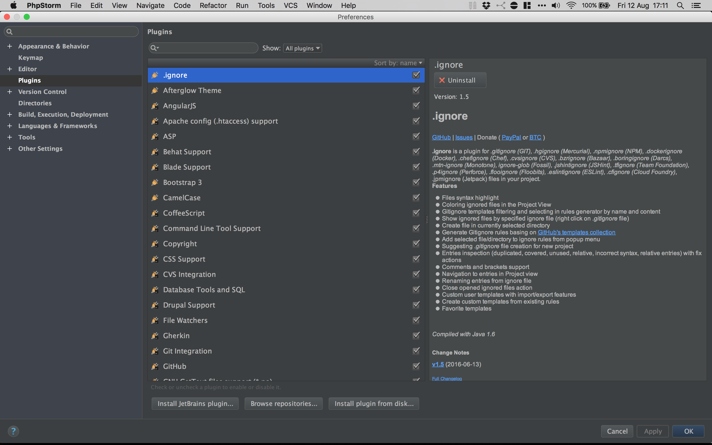
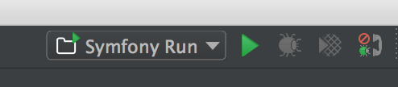
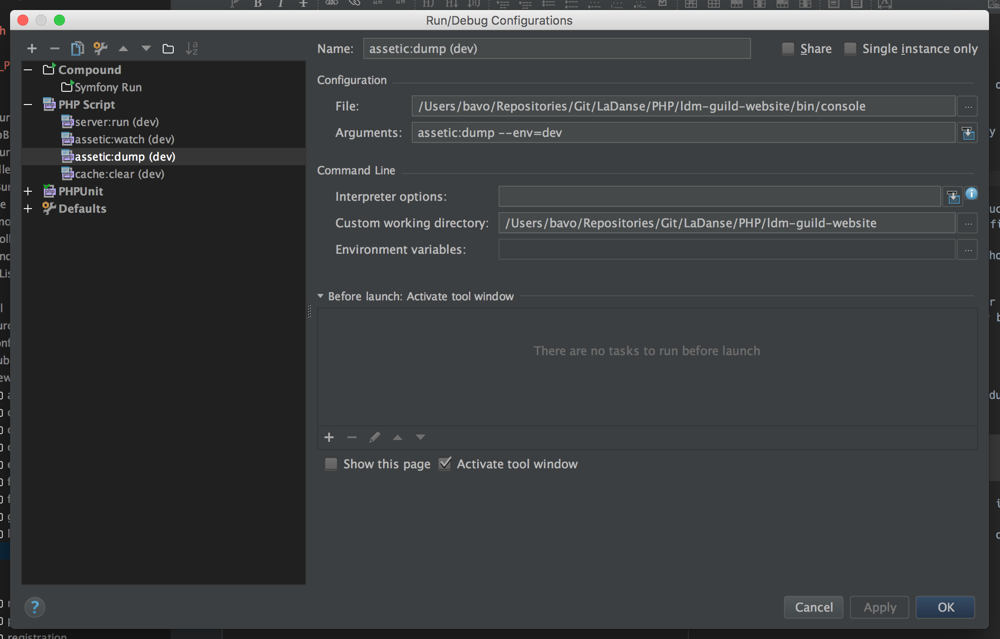
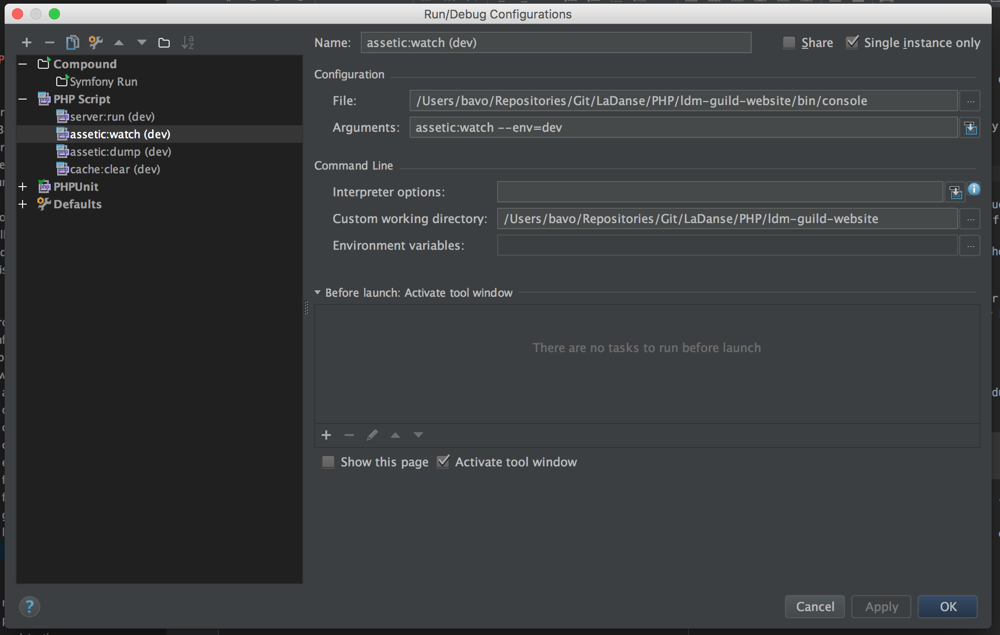
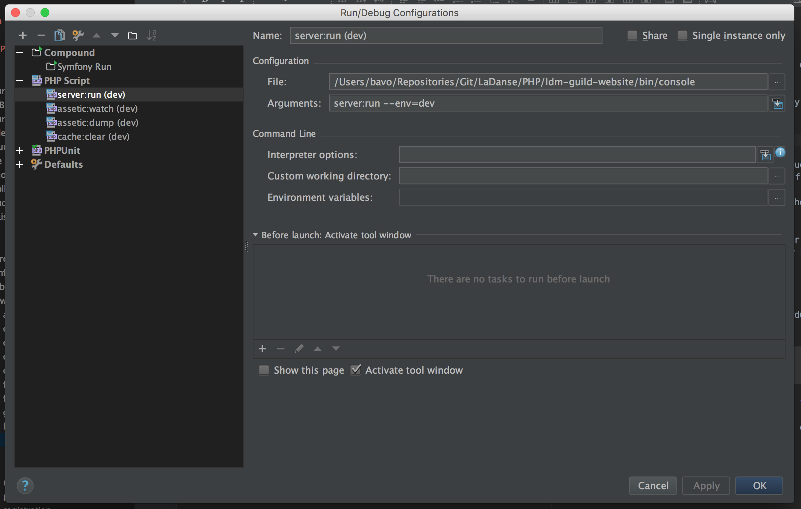
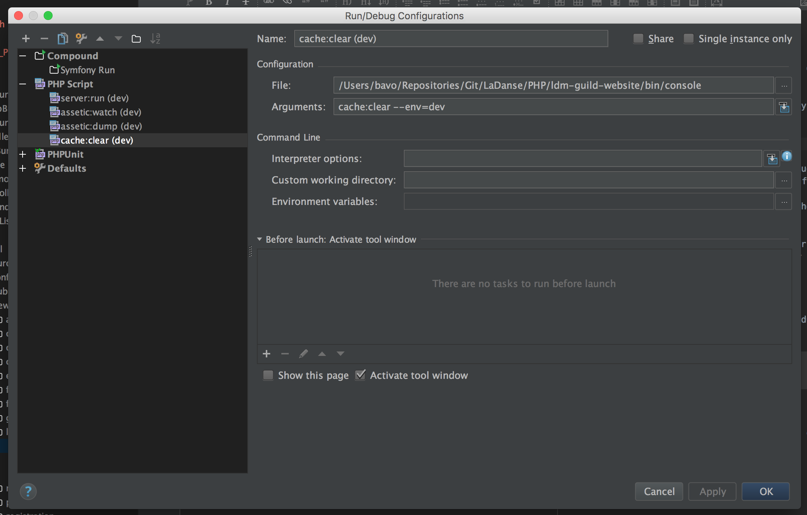
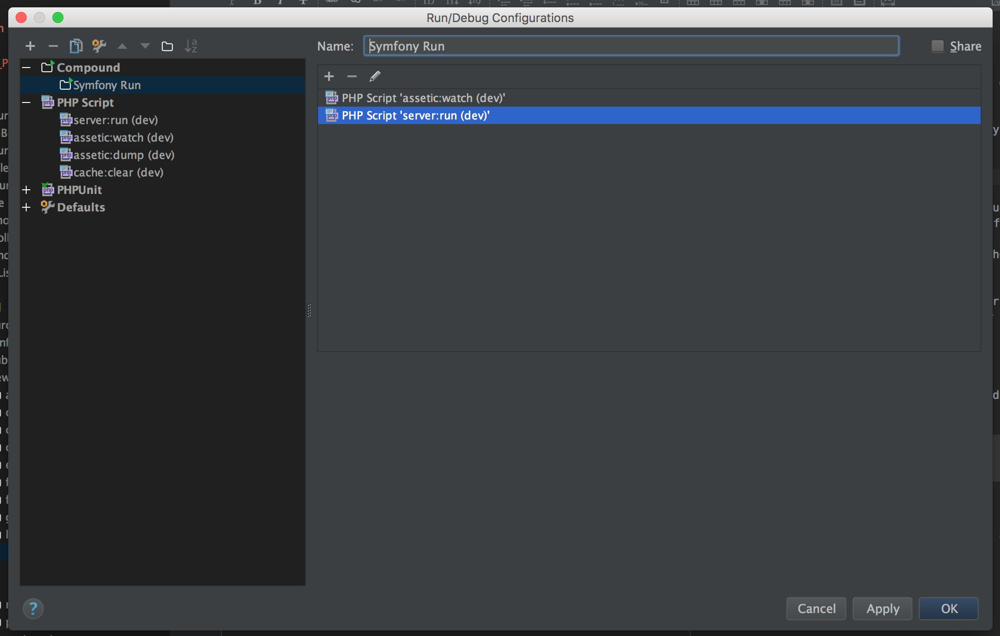

Configuring PHPStorm
====================

This guide covers a basic configuration of PHPStorm. It is by no means a complete guide for PHPStorm and Symfony.

We first cover the installation of some supporting plugins and finally we show how to configure PHPStorm's Run Configurations allowing you to run the project from within PHPStorm.

Plugins
-------

There are some plugins that are not installed by default that will help in developing Symfony projects in PHPStorm.

You can manage your plugin in Preferences -> Plugins. See the screenshot below for the windows you should see. To install additional plugins you click the button titled "Browse Repositories ...".

Verify that the following plugins are installed:

- PHP composer.json support
- Symfony Plugin
- PHP Annotations
- Twig support
- Markdown support
- LESS support
- GitHub

None of the above is mandatory but it will increase your productivity.

Creating the PHPStorm Project
-----------------------------

To add the project to PHPStorm you select "Next Project from Existing Files" from the "File" menu. This will give you a dialog that requests more information about the web server to be used. Select the last option labeled "Source files are in a local directory, no Web server is yet configured".

In the dialog that follows, navigate to the "ldm-guild-website" folder created by cloning the Git repository. With this folder selected, click the "Project Root" button that is above the folder selection view. After that the button "Finish" should active, click this button.

Run Configurations
------------------

In the guide we have so far ran commands in a terminal. We shall now see how you can configure these to be ran by PHPStorm instead.

To achieve this we need to configure "Run Configurations" in PHPStorm. You can find the toolbar for this in the top right of PHPStorm as shown in the screenshot below. This screenshot already shows a run configuration with the name "Symfony Run". Your dropdown menu may be empty.

If you open the dropdown menu you will see an item labeled "Edit Configurations ...", select this item. In the dialog that appears you will see a "+" in the top left corner. Selecting this "+" will allow you to add configurations. We will add 3 "PHP Script" and 1 "Compound" configuration.

We start with the three Script configurations:

- "assetic:dump"
- "assetic:watch"
- "server:run"
- "cach:clear"

We show screenshots of how the dialog for each of these run configurations should look like. You will of course have to change full path to the `bin/console` script based on where you cloned the Git repository.

For "assetic:dump":

For "assetic:watch":

For "server:run":

For "cache:clear":

Finally we create a compound run configuration which will start "assetic:watch" and "server:run" at the same time. The configuration is shown in the screenshot below:

